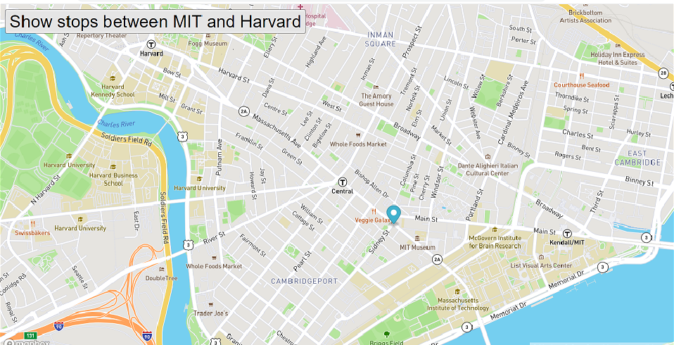

# Buses
The Real-Time Bus Tracking exercise taught us to get an access code and extract data from Mapbox.com, create a marker for bus stops, and then animate the marker through real-time bus tracking.  In order to use this, you will need to obtain an access code of your own from Mapbox and enter it where the code says 'YOUR ACCESS CODE HERE'.

