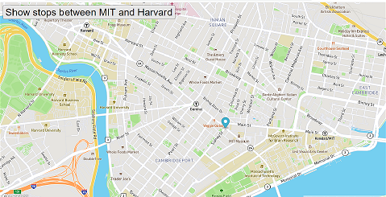

# Buses
The Real-Time Bus Tracking exercise taught us to create a marker for bus stops, overlay it on a map, get an API access token and extract data from Mapbox.com, and finally to animate the marker for real-time bus tracking.  In order to use this, you will need to obtain an access code of your own from Mapbox.com as instructed below.

To use this demo:

1) Fork this repo to your own Github repository
2) From your own repo, choose the green "Code" button and from the pull-down menu choose to "Clone" using your SSH key and copy the URL
3) Go to your local Git (I use Gitbash from Windows Terminal) and type "git clone " and then paste the URL
4) Go to your IDE (I use Visual Studio) and open the folder where you saved the demo
5) Open a blank tab on your Internet browser and drag the "index.html" file to it
6) Go to Mapbox.com, create an account and request your own API access token for the Real-Time Map
7) Copy and paste your API access token into mapanimation.js where the code says 'YOUR ACCESS CODE HERE'
8) Refresh your Internet browser to see the marker move from bus stop to bus stop.

# Road Map of Future Improvements
I would like to improve this demo by allowing the user to choose from various transit authorities at the onset and various routes, and then have those routes shown in real-time.

# License
MIT License

Copyright (c) 2022 Aileen Marquez

Permission is hereby granted, free of charge, to any person obtaining a copy
of this software and associated documentation files (the "Software"), to deal
in the Software without restriction, including without limitation the rights
to use, copy, modify, merge, publish, distribute, sublicense, and/or sell
copies of the Software, and to permit persons to whom the Software is
furnished to do so, subject to the following conditions:

The above copyright notice and this permission notice shall be included in all
copies or substantial portions of the Software.

THE SOFTWARE IS PROVIDED "AS IS", WITHOUT WARRANTY OF ANY KIND, EXPRESS OR
IMPLIED, INCLUDING BUT NOT LIMITED TO THE WARRANTIES OF MERCHANTABILITY,
FITNESS FOR A PARTICULAR PURPOSE AND NONINFRINGEMENT. IN NO EVENT SHALL THE
AUTHORS OR COPYRIGHT HOLDERS BE LIABLE FOR ANY CLAIM, DAMAGES OR OTHER
LIABILITY, WHETHER IN AN ACTION OF CONTRACT, TORT OR OTHERWISE, ARISING FROM,
OUT OF OR IN CONNECTION WITH THE SOFTWARE OR THE USE OR OTHER DEALINGS IN THE
SOFTWARE.
